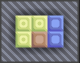
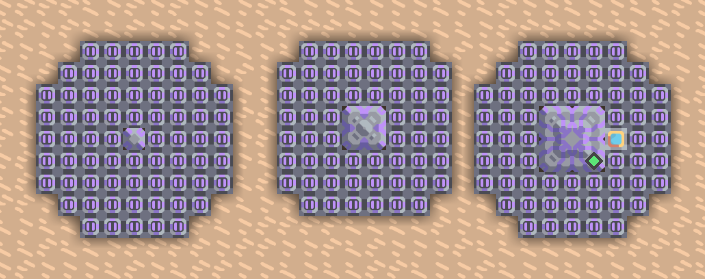
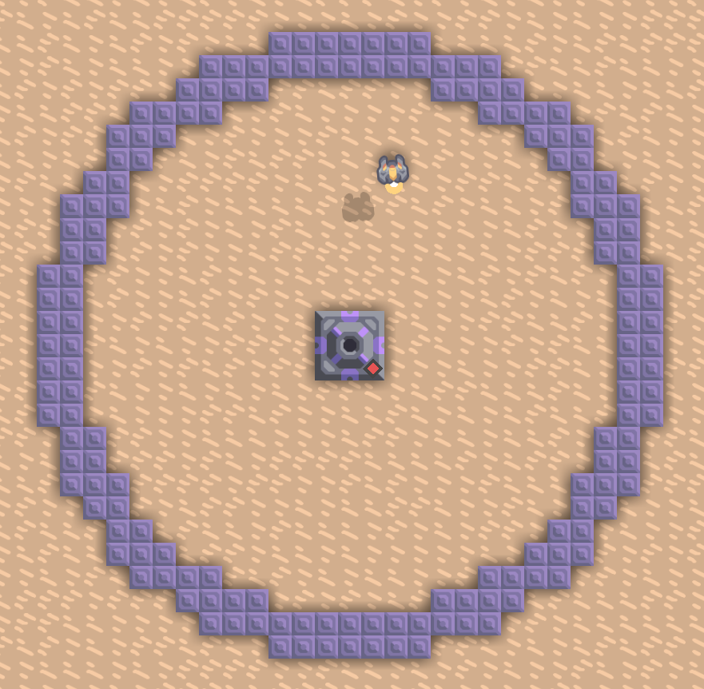

# Schemacode

Schemacode is a specialized definition language designed to describe the structure of Mindustry Schematics. Schemacode definitions can be compiled into Mindustry schematic, either as a binary `.msch` file, or as a text.

While simple schematics can be easily created in Schemacode from scratch, a better method for creating more complicated designs is this: build the schematic in Mindustry, export it to a `.msch` file or copy it to the clipboard as a text and get a valid Schemacode representation by decompiling the schematic. To decompile a
`.msch` file, the [command line tool](TOOLS-CMDLINE.markdown) has to be used; decompiling a text representation obtained via clipboard is possible through the [web application](https://mindcode.herokuapp.com/schematics/decompiler).

Schemacode supports almost all existing features of Mindustry schematics. Specifically, all features employed by Serpulo technology are fully supported. Features specific to Erekir (such as canvas pictures) are unavailable.

Most importantly, logic processors can be fully configured using Schemacode. When specifying the code to be embedded in a given processor, it is possible to use either the native mlog language or Mindcode. The source code (both mlog and Mindcode) can also be injected into the schematic from an external file when building it using the command line tool.

It might be useful to have a look at existing Schemacode samples at https://mindcode.herokuapp.com/schematics before going on with this documentation.

# Whitespace and comments

Whitespace is used to separate all tokes in Schemacode. End-of-line characters have no special meaning (except in text blocks, where they're preserved). There's no character (such as `;`) separating commands in Schemacode.

Schemacode supports line comments using the `//` characters: everything after `//` is ignored.

# Schemacode file structure

On the topmost level, the Schemacode source may contain two kinds of definitions:

* String value definition
* Schematic definition

The Schemacode source must contain exactly one schematic definition, and zero or more string value definitions, in any order.

# String value definition

The string value definition has the following form:

```
id = "String literal"
```

or

```
id = """
    Text
    block
    """
```

or

```
id = '''
    Text
    block
    '''
```

No escape characters are recognized in either kind of string values. To encode line endings into string values, the text block version must be used. It is possible to use triple double quotes in string literals when they're defined as text blocks marked by triple single quotes (and vice versa).

Text blocks indents are removed when interpreting the value of the literal.

# Schematic definition

The schematic definition code has the following form:

```
schematic
    <definition>
    <definition>
    ...
end
```

where _definition_ is either an _attribute definition_, a _region definition_, or an _element placement_, in any order. By convention, the attribute definitions should come first. Region definition needs to be declared before being used.

# Attribute definition

Defines various attributes of the schematic. The syntax of the attribute definition is:

```
attribute = value
```

The following attributes are recognized:

* `name`: specifies the name of the schematic. The value of the attribute is String (a string text value, a string literal, or a text block). Can be specified at most once.
* `filename`: specifies the output file name for the schematic. The value of the attribute is String. Can be specified at most once.
* `description`: specifies the description of the schematic. The value of the attribute is String (a string text value, a string literal, or a text block). In the case of text block, single newline characters are removed; an empty line must be used to define a line break. Can be specified at most once.
* `dimensions`: specifies the dimensions of the schematic, given as `(width, height)`, where `width` and `height` are positive numbers. Can be specified at most once. When not specified, the dimensions are calculated from schematic definition. Must not be smaller than calculated dimensions when specified. (In the future, specifying dimensions different from calculated ones might serve some specific purpose.)
* `tag`: assigns a tag to the schematic. The tag can be either a String value or a predefined icon (see [Icons](SYNTAX-1-VARIABLES.markdown#constants-representing-built-in-icons)). `tag` attribute can be specified more than once; all specified tags are attached to the schematic.
* `target`: specifies the target of the schematic. The assigned value must match one of the [existing Mindustry versions](SYNTAX-5-OTHER.markdown#option-target). The target is also applied when compiling Mindcode assigned to processors (although it is possible to override the target within the Mindcode source code using the `#set target` directive). Can be specified at most once.
* `mindcode`: specifies a snippet of Mindcode source code to be prepended to any Mindcode source code assigned to a processor in this schematic. The value of the attribute is String (a string text value, a string literal, or a text block). This attribute can be primarily used to specify compiler options for the entire schematics. 
* `mlog`: like `mindcode`, specifies a snippet of mlog code to be prepended to any mlog code assigned to a processor in this schematic. The value of the attribute is String (a string text value, a string literal, or a text block). Note: if the specified code contains any actual mlog instructions, it may cause the code assigned to processors to become incorrect or invalid due to instruction addresses shifting.    

# Region definition

Region definition creates a named, reusable region of blocks. A region has dimensions (either explicitly defined or computed) and can contain any number of blocks.

```
<name> = region [(<width>, <height>)]
    <element placement>
    <element placement>
    ...
end
```

- `<name>` is a name of the region. Region names are identifiers and should start with an upper-case letter.
- `<width>` and `<height>` are optional dimensions of the region. When specified, they need to be enclosed in parentheses.
- `element placement`: defines an element that will be part of a region.

Named regions can be placed multiple times into the schematics, either as single elements or as an array of elements. A region has rectangular dimensions, which is either computed from the contents of the region or explicitly defined by the `width` and `height` attributes. The region dimensions are used when placing arrays of regions into the schematics.

Regions may contain empty tiles not occupied by any blocks and may also place blocks outside the region's dimensions. This allows creating regions with irregular but tileable shapes which may be used as region arrays.

It is possible to use any earlier defined named regions in the region definition.

# Element placement

Element placement places an element – a _block_, _named region_ or _anonymous region_ – at certain coordinates within the schematic. The syntax of the element placement is:

```
[labels] <element-type> [<placement-mode> [<element-position>]] [element-array-specification] [flip <axis>] [facing <direction>] [configuration]
```

All clauses except the _element_ clause are optional. When present, the clauses must be arranged in the specified order. 

## Labels

A block can be assigned one or more labels. Labels are identifiers, separated by commas and followed by a colon, e.g.

```
cell1, cell2: @memory-cell at (3, 5)
```

creates a memory cell at coordinates (3, 5) and assigns labels `cell1` and `cell2` to it.

Labels are useful for creating references to labeled blocks. As labels may be used directly as link names when specifying [processor links](#processor-links), it is often desirable to use a literal or a symbolic link name for a block label.

> [!NOTE]
> For more complex schematic, using [symbolic link names](#symbolic-link-names) as labels is strongly recommended. Symbolic names can describe the function of the block in the schematic, and using them leaves the task of assigning literal link names to blocks in different processors to the compiler, simplifying the link management and maintenance significantly.

### Array labels

Element labels may end with a `#` or `$` character, representing a _global array label_ or _local array label_ respectively. In this case, Schemacode generates unique label for each new block by replacing the `#` or `$` character with an index starting at `1`, in the order they're encountered in the definition file. Array labels may be specified multiple times in the definition file, each occurrence being replaced with a unique label. Global array labels use indexes unique within the entire schematic, while local array labels use indexes unique within the region they're defined in.

> [!NOTE]
> Global label arrays are resolved twice: once when resolving block labels, and once when resolving processor links and connections. On both occasions, the indexing starts at `1`. 

When used with an [element array](#element-arrays), names are generated from the label array for elements that do not have a regular label assigned. The array label may be used stand-alone or in conjunction with regular labels, but at most one label array can be used per element array.

Global and local array labels may be either symbolic (e.g., `button#`) or literal (`switch#`). Literal link names must conform to the naming scheme of all the block types they represent. Symbolic names may represent blocks of different types, assuming they are properly resolved to the correct block type in the attached Mindcode source.

## Element type

There are three possible types of elements:

- Mindustry blocks,
- named regions,
- anonymous regions.

### Mindustry blocks

A Mindustry block is specified as a built-in block type, including the `@` sign at the beginning, for example `@switch`, `@micro-processor` or `@battery-large`. Only built-in block types are supported at this moment, blocks added by mods cannot be used.

Furthermore, `@air` can be used as a block name. There are two possible uses:

- When used with [`replace`](#placement-mode), `@air` can be used to completely remove blocks from the schematics.
- When used with a label, the label can be used to refer to the position of the block when specifying other element positions or configuration links (processor, nodes, or bridges).

All supported block types are listed below.

<details><summary>Show a full list of block in the Turret category.</summary>

<!--- list:blocks:turret --->

* `@afflict`
* `@arc`
* `@breach`
* `@cyclone`
* `@diffuse`
* `@disperse`
* `@duo`
* `@foreshadow`
* `@fuse`
* `@hail`
* `@lancer`
* `@lustre`
* `@malign`
* `@meltdown`
* `@parallax`
* `@ripple`
* `@salvo`
* `@scathe`
* `@scatter`
* `@scorch`
* `@segment`
* `@smite`
* `@spectre`
* `@sublimate`
* `@swarmer`
* `@titan`
* `@tsunami`
* `@wave`

</details>

<details><summary>Show a full list of block in the Production category.</summary>

<!--- list:blocks:production --->

* `@blast-drill`
* `@cliff-crusher`
* `@cultivator`
* `@eruption-drill`
* `@impact-drill`
* `@large-cliff-crusher`
* `@large-plasma-bore`
* `@laser-drill`
* `@mechanical-drill`
* `@oil-extractor`
* `@plasma-bore`
* `@pneumatic-drill`
* `@vent-condenser`
* `@water-extractor`

</details>

<details><summary>Show a full list of block in the Distribution category.</summary>

<!--- list:blocks:distribution --->

* `@armored-conveyor`
* `@armored-duct`
* `@bridge-conveyor`
* `@conveyor`
* `@distributor`
* `@duct`
* `@duct-bridge`
* `@duct-router`
* `@duct-unloader`
* `@inverted-sorter`
* `@item-source`
* `@item-void`
* `@junction`
* `@mass-driver`
* `@overflow-duct`
* `@overflow-gate`
* `@phase-conveyor`
* `@plastanium-conveyor`
* `@router`
* `@sorter`
* `@surge-conveyor`
* `@surge-router`
* `@titanium-conveyor`
* `@underflow-duct`
* `@underflow-gate`
* `@unit-cargo-loader`
* `@unit-cargo-unload-point`
* `@unloader`

</details>

<details><summary>Show a full list of block in the Liquid category.</summary>

<!--- list:blocks:liquid --->

* `@bridge-conduit`
* `@conduit`
* `@impulse-pump`
* `@liquid-container`
* `@liquid-junction`
* `@liquid-router`
* `@liquid-source`
* `@liquid-tank`
* `@liquid-void`
* `@mechanical-pump`
* `@phase-conduit`
* `@plated-conduit`
* `@pulse-conduit`
* `@reinforced-bridge-conduit`
* `@reinforced-conduit`
* `@reinforced-liquid-container`
* `@reinforced-liquid-junction`
* `@reinforced-liquid-router`
* `@reinforced-liquid-tank`
* `@reinforced-pump`
* `@rotary-pump`

</details>

<details><summary>Show a full list of block in the Power category.</summary>

<!--- list:blocks:power --->

* `@battery`
* `@battery-large`
* `@beam-link`
* `@beam-node`
* `@beam-tower`
* `@chemical-combustion-chamber`
* `@combustion-generator`
* `@differential-generator`
* `@diode`
* `@flux-reactor`
* `@impact-reactor`
* `@neoplasia-reactor`
* `@power-node`
* `@power-node-large`
* `@power-source`
* `@power-void`
* `@pyrolysis-generator`
* `@rtg-generator`
* `@solar-panel`
* `@solar-panel-large`
* `@steam-generator`
* `@surge-tower`
* `@thermal-generator`
* `@thorium-reactor`
* `@turbine-condenser`

</details>

<details><summary>Show a full list of block in the Defense category.</summary>

<!--- list:blocks:defense --->

* `@beryllium-wall`
* `@beryllium-wall-large`
* `@blast-door`
* `@carbide-wall`
* `@carbide-wall-large`
* `@copper-wall`
* `@copper-wall-large`
* `@door`
* `@door-large`
* `@phase-wall`
* `@phase-wall-large`
* `@plastanium-wall`
* `@plastanium-wall-large`
* `@reinforced-surge-wall`
* `@reinforced-surge-wall-large`
* `@scrap-wall`
* `@scrap-wall-gigantic`
* `@scrap-wall-huge`
* `@scrap-wall-large`
* `@shielded-wall`
* `@surge-wall`
* `@surge-wall-large`
* `@thorium-wall`
* `@thorium-wall-large`
* `@thruster`
* `@titanium-wall`
* `@titanium-wall-large`
* `@tungsten-wall`
* `@tungsten-wall-large`

</details>

<details><summary>Show a full list of block in the Crafting category.</summary>

<!--- list:blocks:crafting --->

* `@atmospheric-concentrator`
* `@blast-mixer`
* `@carbide-crucible`
* `@coal-centrifuge`
* `@cryofluid-mixer`
* `@cyanogen-synthesizer`
* `@disassembler`
* `@electric-heater`
* `@electrolyzer`
* `@graphite-press`
* `@heat-reactor`
* `@heat-redirector`
* `@heat-router`
* `@heat-source`
* `@incinerator`
* `@kiln`
* `@melter`
* `@multi-press`
* `@oxidation-chamber`
* `@phase-heater`
* `@phase-synthesizer`
* `@phase-weaver`
* `@plastanium-compressor`
* `@pulverizer`
* `@pyratite-mixer`
* `@separator`
* `@silicon-arc-furnace`
* `@silicon-crucible`
* `@silicon-smelter`
* `@slag-centrifuge`
* `@slag-heater`
* `@slag-incinerator`
* `@small-heat-redirector`
* `@spore-press`
* `@surge-crucible`
* `@surge-smelter`

</details>

<details><summary>Show a full list of block in the Units category.</summary>

<!--- list:blocks:units --->

* `@additive-reconstructor`
* `@air-factory`
* `@basic-assembler-module`
* `@constructor`
* `@deconstructor`
* `@exponential-reconstructor`
* `@ground-factory`
* `@large-constructor`
* `@large-payload-mass-driver`
* `@mech-assembler`
* `@mech-fabricator`
* `@mech-refabricator`
* `@multiplicative-reconstructor`
* `@naval-factory`
* `@payload-conveyor`
* `@payload-loader`
* `@payload-mass-driver`
* `@payload-router`
* `@payload-source`
* `@payload-unloader`
* `@payload-void`
* `@prime-refabricator`
* `@reinforced-payload-conveyor`
* `@reinforced-payload-router`
* `@repair-point`
* `@repair-turret`
* `@ship-assembler`
* `@ship-fabricator`
* `@ship-refabricator`
* `@small-deconstructor`
* `@tank-assembler`
* `@tank-fabricator`
* `@tank-refabricator`
* `@tetrative-reconstructor`
* `@unit-repair-tower`

</details>

<details><summary>Show a full list of block in the Effect category.</summary>

<!--- list:blocks:effect --->

* `@advanced-launch-pad`
* `@build-tower`
* `@container`
* `@core-acropolis`
* `@core-bastion`
* `@core-citadel`
* `@core-foundation`
* `@core-nucleus`
* `@core-shard`
* `@force-projector`
* `@illuminator`
* `@interplanetary-accelerator`
* `@landing-pad`
* `@large-shield-projector`
* `@launch-pad`
* `@mend-projector`
* `@mender`
* `@overdrive-dome`
* `@overdrive-projector`
* `@radar`
* `@regen-projector`
* `@reinforced-container`
* `@reinforced-vault`
* `@shield-projector`
* `@shock-mine`
* `@shockwave-tower`
* `@vault`

</details>

<details><summary>Show a full list of block in the Logic category.</summary>

<!--- list:blocks:logic --->

* `@canvas`
* `@hyper-processor`
* `@large-canvas`
* `@large-logic-display`
* `@logic-display`
* `@logic-processor`
* `@memory-bank`
* `@memory-cell`
* `@message`
* `@micro-processor`
* `@reinforced-message`
* `@switch`
* `@tile-logic-display`
* `@world-cell`
* `@world-message`
* `@world-processor`
* `@world-switch`

</details>

### Named regions

A named region is specified using the region's name as defined by the region definition. It is always different from a Mindustry block, as it never starts with the `@` character.  

### Anonymous regions

An anonymous region is specified similarly to the named region, except the name is omitted:

```
region [(<width>, <height>)]
    <element placement>
    <element placement>
    ...
end
```

Since anonymous regions can't be reused on another place in the schematic, they are usually used to define an element array. Alternatively, they might be used as a means to flip or rotate part of the schematic which was already written without having to rewrite the block coordinates manually.  

## Placement mode

The placement mode is specified using one of the following keywords:

- `at`: regular placement mode. Blocks are placed at the specified position. When any earlier defined block overlaps the newly placed blocks, an error is reported.
- `replace`: replacement mode. When a block is being placed in this mode, any earlier defined block that overlaps it - even partially - is completely removed from the schematic. Its label(s), if any, must not be reused and must not be referenced from any configuration. (It is, however, possible to use the label assigned to a block being replaced when replacing it.)
- `fill`: fill mode. When a block is being placed in this mode, it is placed only on positions which do not overlap already defined blocks. Positions that would overlap a block are not used, and labels assigned to those blocks are not created.

When a region is placed in the replacement or fill mode, all blocks instantiated by the region are handled in the mode defined by the enclosing region. All fill/replace operations are done on the final layout of blocks. So, for example, if there is a region containing fill-mode blocks, the fill operation isn't applied when the region is constructed, but when all blocks are placed. Example:

```
schematic
    @plastanium-wall at (0, 0) * (2, 2)
    REG: region
        @copper-wall at (0, 0)
        @titanium-wall fill (0, 0) * (2, 2)
    end replace (1, 0)
end
```



The titanium wall is only placed on tiles that are free in the entire schematics, not on tiles that are free within the `REG` region.

When a region containing empty tiles is placed in the replacement mode, the original blocks at the empty tiles don't get erased. However, putting `@air` explicitly in the region does erase underlying blocks when using `replace` with the entire region.

> [!TIP]
> The replacement mode allows making changes to block arrays created with blocks or regions – for example, a factory constructed by repeating a region containing a basic unit may be customized on the input/output edges.
> 
> The fill mode allows creating rectangular walls around compact regions, or filling empty areas in the schematic with filler blocks (such as batteries, solar panels, or walls).
> 
> Using `fill` or `replace` when placing regions is questionable practice and should be avoided.

## Element position

Element position can be specified as relative or absolute. When completely omitted, the position is assumed to be `(0, 0)`.  

The first element defined by the schematic must use an absolute position (or can omit the position, placing it at the schematic origin), but all following blocks can use absolute or relative positions. Relative position always relates to the previous block, as defined by the schematic.

Element position can be specified using this syntax:

```
[+-] (x, y)
```

The `+` or `-` sign, if used, specifies relative position, in which case the `x` and `y` coordinates are added to or subtracted from previous element position. When no plus or minus sign is used, the coordinates specify an absolute position for the element.

It is also possible to specify a position relative to another block using this syntax:

```
label {+-} (x, y)
```

In this case, the position is specified as an offset against the position of a block labeled with `label`. When no regions are used within the schematic, the label simply corresponds to the block's label. Blocks placed in regions may be referenced using a [fully or partially specified path](#referencing-blocks).   

All three ways of specifying an element position can be seen in this example:

```
schematic
  name "Example"
message1:
  @message at (1, 0)                      // Places block at (1, 0)
switch1:
  @switch at +(1, 0)                      // Places block at (2, 0)              
  @micro-processor at switch1 - (2, 0)    // Places block at (0, 0)
end
```

Blocks in the schematic must not overlap. Overlapping blocks are detected and cause compilation error.

Elements larger than 1x1 are placed into the schematic in such a way that their lower-left corner is at the given coordinates. This makes it quite natural to design schematic starting in the lower left corner, i.e., from coordinates (0, 0), and building right and up (or up and right).

Element position may also be negative (see [Origin and dimensions calculation](#origin-and-dimensions-calculation)).

Correctly positioning blocks, especially blocks larger than 1x1, can be a bit tricky. For more complex layouts, it is easier to create the schematic in Mindustry, decompile to Schemacode definition, and modify the resulting file.

### Element arrays

Element arrays are rectangular areas filled with regions or blocks of the same type and configuration. An element array always contains the original element at the specified position (an _anchor element_). To create an element array, an array specification needs to be specified after the element position:

```
<area-operator> (x, y) [<array-orientation>]
```

where `<area-operator>` is one of the following:

* `..` - inclusive range operator. The array will cover the smallest rectangular area which contains the anchor element and an element at the `(x, y)` coordinates.
* `...` - exclusive range operator. The array will cover the largest rectangular area which contains the anchor element and no element at the `(x, y)` coordinates.
* `*` - area size operator. The array will start at the anchor block and extend `x` blocks horizontally and `y` blocks vertically.

For range operators, the following rules apply:

* The coordinates are interpreted using the same coordination system as the element position coordinates – that is, absolutely if the element position was specified absolutely, and relatively if the element position was specified relatively.
* If the array coordinate is higher than the anchor element coordinate, the array extends to the right or up from the anchor block. If the array coordinate is lower than the anchor element coordinate, the array extends to the left or down from the anchor block.

For area size operator, the following rules apply:

* When a dimension is positive, the array extends to the right or up from the anchor block. When a dimension is negative, the array extends to the left or down from the anchor block.

Area size operator is most useful when creating an aray of fixed size (e.g., a tile display of given dimensions). The range operators are most useful when trying to cover an area up to a certain position (e.g., a wall).

The `<array-orientation>` is optional and can be one of the following:

* `horizontal` (the default): the element array is built horizontally (i.e., row by row).
* `vertical`: the element array is built vertically (i.e., column by column).

The array orientation affects the processing order of the elements, which includes the order in which labels are assigned to the elements.

When the block array resolves to an empty area, an error is reported. When the block array resolves to a single block (for example, `@switch at (3, 5) * (0, 0)`, or `@copper-wall-large at (2, 2) ... (4, 4)`), it is treated as a regular block and not a block array (the distinction is important when processing labels for the block).

When an orientation or configuration is specified for a block array, it is applied to each block in the array.

### Circular element arrays

It is also possible to add circular-shaped element arrays. These arrays fill a circular region around a position.

```
[odd | even] radius r [<array-orientation>]
```

Circular-shaped arrays are meant to be centered around a block. `r` is the radius of the circular region. The `even` and `odd` keywords specify the parity of block sizes (the central block versus the surrounding blocks):
- `even`: both blocks' sizes are even or both blocks' sizes are odd.
- `odd`: one block's size is even, and the other block's size is odd.

When not specified, the default is `even`.

If the block that should be placed at the center of the array is larger than 2 tiles, the anchor position of the array needs to be altered by adding half the block size to the coordinates.

There are two expected use-cases:
- Putting as many blocks within the range of a processor as possible (e.g., memory cells or other processors for maximum storage).
- Creating a circular wall around a region.

```
schematic
    name "Example"

    @micro-processor at (0, 0) processor
        links a* as cell$ end
    end
    a$: @memory-cell fill (0, 0) radius 4

    @logic-processor at (10, 0) processor
        links b* as cell$ end
    end
    b$: @memory-cell fill (10, 0) even radius 4

    @hyper-processor at (19, -1) processor
        links c* as cell$ end
    end
    @liquid-source at +(3, 1) liquid @cryofluid
    c$: @memory-cell fill (20, 0) radius 4
end
```

Resulting schematic:



Building a wall:

```
schematic
    name "Example"

    @thorium-reactor

    // This ensures the wall won't fill empty tiles within this radius
    @air fill (1, 1) radius 11
    @thorium-wall fill (1, 1) radius 13
end
```

Resulting schematic:



### Region arrays

When creating an array consisting of regions, the region dimensions are used to determine the spacing of individual regions. As regions may contain free space, as well as blocks outside their own dimensions, it is possible to create arrays consisting of elements that are not rectangular.

### Labels for element arrays

One or more labels, including array labels, can be specified for a block array. The labels are assigned to the block in the array in the processing order, always starting at the anchor block. If there are more labels specified (array or regular) than is the total number of blocks in the array, an error is reported. If there are only regular arrays specified and their number is smaller than the total number of blocks in the array, the remaining blocks are left unlabeled.

If the labels include at least one array label, the last such label in the list is repeated a number of times needed to assign a label to each block in the array. If the last label in the list is a regular label, it will always be assigned to the last block in the array. Example:

```
up, down, size$, volume$, left, right: @switch at (0, 8) * (1, -8) 
```

This will create an array of eight switches in the top-down order and assign them the following symbolic labels:

* `up`
* `down`
* `size1`
* `volume1`
* `volume2`
* `volume3`
* `left`
* `right`

Note: the literal link names assigned to the symbolic link names depend on the order in which the symbolic labels are encountered in the Mindcode source file.

## Transposition and rotation

Transposition allows flipping elements horizontally or vertically, while rotation allows rotating elements by 90, 180, or 270 degrees.

> [!IMPORTANT]
> Transposition is always applied before rotation. 
>
> When rotation is applied to a region array, the region is rotated before the array is built.

### Blocks

Transposition is specified using the `flip` keyword:

```
flip <horizontal|vertical>
```

`horizontal` flips the element horizontally, `vertical` flips the element vertically. Transposing the element along both axes is not supported (such a transposition would be identical to rotating the element by 180 degrees, i.e., to the `west`).

Transposition has a limited effect on blocks but may be more useful with regions. 

Each block in the schematic has an orientation, although specific orientation affects only some types of blocks (such as conveyors or unit factories). Orientation can take four values - `east`, `west`, `north` or `south` - and is specified using this syntax:

```
facing <orientation>
```

e.g., `@conveyor at (2, 4) facing west`.

The cardinal directions are related to the coordinate system of the schematic, i.e., conveyor facing east is moving items from left to right.

> [!NOTE]
> When a block is flipped horizontally, the block's default orientation changes from `east` to `west`. Subsequent rotation is then compounded with the altered orientation; rotating a horizontally flipped block to `north` results in a block with the `south` orientation.

### Regions

The `flip` and `facing` clauses can be also applied to regions. In that case, the entire region is flipped and rotated to face the new cardinal directon (the original, non-rotated direction is `east`). When the region is flipped or rotated, all contained elements - both blocks and nested regions - are flipped and rotated accordingly. Nested regions themselves can be also flipped or rotated.

## Block configuration

Some blocks are stored with specific configurations: connection for bridges or power nodes, item type for unloaders, text for messages or links, and code for processors. Schemacode supports the following types of configuration:

* [Block type](#block-type-configuration): block type selected in a constructor or a payload source (a sandbox-only block), or a payload router.
* [Boolean](#boolean-configuration): on/off or open/close, for switches and doors.
* [Color](#color-configuration): color of the illuminator block.
* [Single connection](#connection-configuration): connection to another block (e.g., a bridge or a mass driver).
* [Multiple connections](#connection-configuration): connections to several different blocks (e.g., for power nodes).
* [Item](#item-configuration): item type selected in a sorter, unloader, or similar block.
* [Liquid](#liquid-configuration): liquid type selected in a liquid source (a sandbox-only block).
* [Unit](#unit-configuration): unit type selected in a unit factory, a payload source, or a payload router.
* [Unit command](#unit-command-configuration): unit command selected in a reconstructor.
* [Text](#text-configuration): text contents for message blocks.
* [Processor](#processor-configuration): links and code for logic processors.
* Virtual: a specific configuration marking blocks that aren't part of the schematic but can be used as link targets. The keyword is accepted by Schematic Builder but has no meaning at the moment.

## Block type configuration

Block type configuration is specified as `block` followed by block type name (including the `@` prefix):

```
    @payload-source at (1, 0) block @large-copper-wall
```

The following block types can have block type configuration specified:

* `@payload-router`
* `@payload-source`
* `@constructor`
* `@large-constructor`

## Boolean configuration

Boolean configuration is specified as `enabled` or `disabled` for the values of true/false or opened/closed:

```
@door at (1,0) enabled   // Creates an opened door
```

The following block types can have boolean configuration specified:

* `@door`
* `@door-large`
* `@switch`
* `@world-switch`

## Color configuration

Color configuration is specified as `color rgba(<red>, <green>, <blue>, <alpha>)`, where `<red>`, `<green>` and `<blue>` are the value if individual color components, while `<alpha>` is the value of the alpha channel. All these values must be given as a number between `0` and `255`, inclusive. Alpha specifies the opacity, `0` is not opaque at all (i.e., fully transparent), `255` is fully opaque. The exact handling of the alpha channel is done by the illuminator block; generally speaking, higher values of alpha make the illuminator lightning more prominent.

This example specifies an illuminator block emitting intense green color:

```
    @illuminator at (0, 0) color rgba(0, 255, 0, 255)
```

The following block types can have color configuration specified:

* `@illuminator`

## Connection configuration

Connection configuration is specified as `connected to` followed by a comma-separated list of absolute or relative positions; relative positions are related to the block being configured. It is also possible to specify a [block reference](#referencing-blocks):

```
    @bridge-conveyor     at (0, 0) connected to (0, 2)    // Connects to the bridge at (0, 2)
    @bridge-conveyor     at (0, 2) connected to bridge3   // Connects to the bridge at (0, 4)
bridge3:
    @bridge-conveyor     at (0, 4) connected to -(0, 1)   // Connects to the bridge at (0, 3)
```

Multiple connections are separated by commas, and it is possible to mix different ways to specify a position:

```
    @power-node at (5, 5) connected to (1, 1), -(2, 3), +(1, -1), node2, reactor4
```

The node is connected to blocks at positions (1, 1), (3, 2), (6, 4) and `node2` and `reactor4`, whatever their positions are.

When connecting to blocks larger than 1x1 by their position, it is sufficient to specify any position occupied by the block, it is not necessary to target the lower left corner.

Connection specified by position may lead to a place not occupied by any block, or even to a place outside the schematic. Such a connection - called a "virtual connection" - is allowed and will be compiled into the schematic. When the schematic is built in the Mindustry map and later a compatible block is added at the position of the virtual connection, the connection will be automatically made.

The following block types can be connected to at most one block:

* `@bridge-conduit`
* `@bridge-conveyor`
* `@mass-driver`
* `@payload-mass-driver`
* `@large-payload-mass-driver`
* `@phase-conduit`
* `@phase-conveyor`

The following block types can be connected to several blocks (the number of available connections depends on the block type):

* `@power-node`
* `@power-node-large`
* `@surge-tower`
* `@beam-link`
* `@power-source`

### Connecting bridges

Both normal and phase bridge connections must conform to the following criteria, otherwise a compilation error occurs:

* At most one connection is allowed.
* The connection must not lead to the same block (no connection to itself).
* The connections must lead to a block of the same type; it is not possible to connect e.g., a `@bridge-conveyor` to a `@phase-conveyor`.
* No circular connections: if a block is connected to another block, the other block must not be connected to the original block.
* The connection must be either vertical or horizontal; diagonal connections of any kind are disallowed.
* The connection distance must not exceed the bridge range.

Connections to empty positions are allowed, and no warnings are generated. When the schematic is built in a Mindustry world and later a bridge of the same type is placed at the target position, the bridge is automatically connected.

### Connecting mass drivers

Mass driver connections must conform to the following criteria, otherwise a compilation error occurs:

* At most one connection is allowed.
* The connection must not lead to the same block (no connection to itself).
* The connections must lead to a block of the same type; it is not possible to connect e.g., a `@payload-mass-driver` to a `@large-payload-mass-driver`.
* The connection distance must not exceed the mass driver range.

Connections to empty positions are allowed, and no warnings are generated.

### Connecting power nodes

Several different blocks in Mindustry represent power nodes: `@power-node`, `@power-node-large`, `@surge-tower`,
`@beam-link` and `@power-source`.

Power node connections must conform to the following criteria, otherwise a compilation error occurs:

* The connection must not lead to the same block (no connection to itself).
* The connection must connect to a block which produces or consumes power, or to another power node. (Note: a diode isn't such a block, power node cannot connect to a diode.)
* The connection distance must not exceed the power node range. When linking two power nodes, the larger of the two power node ranges is used.
* The number of connections (including incoming connections from other power nodes) must not exceed the maximum number of connections for a given type of power node.

When the following situations are detected, a warning is produced and the connection is ignored:

* The connection leads to an empty location.
* The connection to the same block has already been defined.

Connecting two power nodes `N1` and `N2` is possible in any of these ways:

* declaring connection from `N1` to `N2` only,
* declaring connection from `N2` to `N1` only,
* declaring connection in both directions.

In all these cases both the `N1` to `N2` and `N2` to `N1` connections are written to the compiled schematic.

## Item configuration

Item configuration is specified as `item` followed by item name (including the `@` prefix):

```
    @unloader at (1, 0) item @coal
```

The following block types can have item configuration specified:

* `@sorter`
* `@inverted-sorter`
* `@unloader`
* `@duct-router`
* `@duct-unloader`
* `@landing-pad`
* `@surge-router`
* `@unit-cargo-unload-point`
* `@item-source`

## Liquid configuration

Liquid configuration is specified as `liquid` followed by liquid name (including the `@` prefix):

```
    @liquid-source at (1, 0) liquid @cryofluid
```

The following block types can have liquid configuration specified:

* `@liquid-source`

## Unit configuration

Unit configuration is specified as `unit` followed by unit name (including the `@` prefix):

```
    @air-factory at (0, 0) unit @mono
```

Available unit types depend on the type of the factory:

* `air-factory`:      `@flare` or `@mono`
* `ground-factory`:   `@dagger`, `@crawler` or `@nova`
* `naval-factory`:    `@risso` or `@retusa`
* `mech-fabricator`:  `@merui`
* `ship-fabricator`:  `@elude`
* `tank-fabricator`:  `@stell`
* `@payload-router`:  all unit types are allowed
* `payload-source`:   all unit types are allowed

## Unit command configuration

Unit command configuration is specified as `command` followed by the command name (including the `@` prefix):

```
    @multiplicative-reconstructor at (0, 0) command @repair
```

Possible unit commands are

* `move`
* `repair`
* `rebuild`
* `assist`
* `mine`
* `boost`

The following block types can have unit command configuration specified:

* `@additive-reconstructor`
* `@multiplicative-reconstructor`
* `@exponential-reconstructor`
* `@tetrative-reconstructor`

The applicability of a command depends on the type of unit processed by the reconstructor.

## Text configuration

Text configuration assigns a text content to blocks. It is specified as `text` followed by a string literal, text block literal, or string value identifier:

```
schematic
    dimensions (3, 1)
    @message at (0, 0) text "This is a message"
    @message at (1, 0) text """
        This is
        a multiline message"""
    @message at (2, 0) text message-text
end

message-text = """
        This is also a multiline message,
        one with [green]color[] and an additional newline at the end.
        """
```

There's no support to embed built-in icons into the messages at the moment.

The following block types can have text configuration specified:

* `@message`
* `@reinforced-message`
* `@world-message`

## Processor configuration

Processor configuration is the most complex one. It can specify both the code embedded to the processor and links to blocks in the schematic (and even outside the schematic) to the processor. The configuration is specified using the `processor` syntax:

```
    @micro-processor at (0, 0) processor
        links
            <link specifications>
        end
        
        mlog = <mlog code>
        mindcode = <mindcode>
        
        param
            <code parametrization>
        end    
    end 
```

The following block types can have processor configuration specified:

* `@micro-processor`
* `@logic-processor`
* `@hyper-processor`
* `@world-processor`

### Processor links

Processor links are specified in the `links` section. All linked blocks or tiles must lie within the processor's range. 

There are several ways to specify blocks linked to the processor.

#### Linking by block references

By specifying a block reference, it is possible to link to the processor multiple blocks at once. The syntax for specifying block references is: 

```
    links
        <block-reference> [as <link-name>]
    end
```

This links all blocks matched by the [block reference](#referencing-blocks) to the processor. The names under which the block(s) are linked to the processor are derived using these rules:

- When a simple link name is specified, it is used as given. When the block reference resolves to multiple blocks, an error occurs.
- When the link name is a [local array label](#array-labels), all blocks resolved by the block reference are assigned a link name generated from the array label. The same array label may be used multiple times in the same processor configuration, providing unique link names each time it is used.
- When no link name is specified, the link name is derived from the linked block label matched by the block reference:
  - When the block label contains a dash character (`-`), the part of the label after the first dash character is used as a link name.
  - When the block label does not contain a dash character, the entire label is used as a link name.

Additional notes:

- When a block has multiple labels, the one matched by the block reference is used to derive the block name. If the block reference matches multiple labels of the same block, the block would end up being linked multiple times to the same processor, which is an error.
- When a block has been assigned an array label, each instance of a block is labeled using a concrete value of the label. This is the label that gets matched by the block reference and subsequently used to generate the link name.
- It is possible to use patterns and prefixes together with [symbolic link names](#symbolic-link-names).
- The resulting link name must meet the [link name requirements](#link-name-requirements).

Examples:

```
schematic
    @micro-processor at (0, 0) processor
        links * end
        mlog = ""
    end
    switch1:  @switch  at +(1, 0)
    message1: @message at +(1, 0)
end
```

The switch and message blocks are linked to the processor as `switch1` and `message1`, respectively.

A more complicated way uses prefixes to group block labels. It allows linking blocks to more than one processor using pattern matching:

```
schematic
    @micro-processor at (0, 0) processor
        links p1-* end
        mlog = ""
    end
    p1-message1:            @message at +(1, 0)
    p1-switch1, p2-switch1: @switch  at +(1, 0)
    
    @micro-processor at (0, 1) processor
        links p2-* end
        mlog = ""
    end
    p2-message1:            @message at +(1, 0)
end
```

The above example links the switch to both processors as `switch1`, while each message block is linked to separate processor as `message1`.

#### Linking by position

It is also possible to specify linked blocks by their positions. In this case, a name must be assigned explicitly (Schematic Builder doesn't generate link names automatically yet):

```
schematic
    @micro-processor at (0, 0) processor
        links 
             (1, 0) as switch1
            +(2, 0) as message4 virtual
            +(3, 0) as message1    
        end
        mlog = ""
    end
    @switch  at (1, 0)
    @message at (3, 0)
end
```

Relative coordinates evaluate against the processor block.

Pay attention to the `message4` block: its coordinates are (2, 0), which is inside the schematic, but there's no block at these coordinates. The link is created, nevertheless, and when the schematic is built in the Mindustry world, any block placed subsequently on the tile corresponding to the position (2, 0) in the schematic will be automatically linked to the processor. If it is a message, it will be linked as `message4`.

Virtual links can be placed outside the schematic as well. The keyword `virtual` marks such virtual links. It is optional now, but it will become compulsory for virtual blocks in the future.

All the ways to specify processor links can be mixed, for example:

```
schematic
    @micro-processor at (0, 0) processor
        links
            p-*
            message1
            (4, 0) as cell1
            (2, 0) as cell2 virtual    
        end
        mlog = ""
    end
    p-switch1:  @switch  at (1, 0)
    message1:   @message at (3, 0)
    @memory-cell at (4, 0)
end
```

Linking by position may be useful when using block arrays. In this example, an array of switches is linked to an array of processors one-to-one:

```
schematic
    @switch          at (0, 1) * (8, 1)
    @micro-processor at (0, 0) * (8, 1) processor
        links
            +(0, 1) as switch1 
        end
    end
end
```

#### Symbolic link names

Linking by a symbolic name works similarly to linking by a literal name, except the actual link names are assigned by the Mindcode compiler when compiling the code. This makes it much easier to link the same block to different processors using the same symbolic name, without having to readjust the link indexes in case a conflict arises.

A symbolic link name corresponding to each linked block must be declared in the Mindcode source code so that the Mindcode compiler can assign the correct link names. When a corresponding symbolic link name is not declared in the Mindcode source, an error is generated, as the unresolved symbolic link name cannot be used to create the link in the schematic.

```
schematic
    @micro-processor at (0, 0) processor
        links 
            onOff                     // linked using symbolic link name "onOff"       
            a-mainMessage             // linked using symbolic link name "mainMessage", prefix stripped
            a-status as statusMessage // linked using symbolic link name "statusMessage"
        end
        mindcode = code
    end
    onOff:          @switch  at +(1, 0)
    a-mainMessage:  @message at +(1, 0)
    a-status:       @message at +(1, 0)
end

code = """
    linked(@switch) onOff;
    linked(@message) mainMessage, statusMessage;
    
    print("Symbolic link demo"); printflush(mainMessage);
    print("The status is " + onOff.@enabled ? "on" : "off"); printflush(statusMessage);
    """
```

#### Link name requirements

Link names must meet the following conditions:

* A literal link name must correspond to the last part of the block type name (e.g., `drill` for `@laser-drill`, `cell` for `@memory-cell`, and so on; if the last part is `large`, the next-to-last is used as in `node` for `@power-node-large`), followed by a number.
* A symbolic link name must be a valid [Mindcode identifier](SYNTAX-0-BASICS.markdown#identifiers). Symbolic link names must be different from any possible literal link name (`switch1` is a literal link name and therefore is disallowed; `switch` is not a literal link name and therefore is allowed). Mindcode resolves symbolic link names to literal link names when compiling code or building a schematic.
* Link names must be unique, no two linked blocks can share a link name in a single processor.
* Each block can be linked at most once, it is not possible to link the same block twice under different names in a single processor.

### Processor code

It is possible to specify either an mlog code or a Mindcode for the processor. To specify an mlog code, use

```
mlog = <code>
```

To specify Mindcode, use

```
mindcode = <code>
```

At most one of `mlog` or `mindcode` can be specified. If neither of these options is specified, the processor created will not contain any instructions.

`<code>` is one or more code snippets joined together using a `+` (plus) operator. A code snippet can be specified in one of these ways:

* as a string literal,
* as a text block,
* as a string value identifier,
* as a reference to an external file.

A string literal is only useful for really small snippets of code:

```
schematic
    @micro-processor at (0, 0) processor
        links * end
        mindcode = "print(switch1.enabled); printflush(message1);"
    end
    switch1:  @switch  at (1, 0)
    message1: @message at (2, 0)
end
```

A text block allows including line breaks in the code definition:

```
schematic
    @micro-processor at (0, 0) processor
        links * end
        mlog = """
            sensor result switch1 @enabled
            print result
            printflush message1
            """
    end
    switch1:  @switch  at (1, 0)
    message1: @message at (2, 0)
end
```

A string value identifier allows moving the code away from the processor definition for better organization:

```
schematic
    @micro-processor at (0, 0) processor
        links button end
        mindcode = source-code
    end
    button: @switch at +(1, 0)
end

source-code = """
    linked(@switch) button;
    on = button.enabled;
    // Starting at 1, we want to skip the switch
    for link in 1 ... @links do
        device = getlink(link);
        device.enabled = on;
    end;
    """
```

An external file can be defined like this:

```
schematic
    @micro-processor at (0, 0) processor
        links * end
        mindcode = file "../mindcode/regulator.mnd"
    end
    switch1:  @switch  at (1, 0)
    message1: @message at (2, 0)
end
```

The relative file path is evaluated from the directory containing the file being compiled; if the compiled code is read from standard input, it is evaluated from the current directory.

> [!IMPORTANT]
> Only the command line tool allows you to use code from an external file. The web application cannot access your local files by specified path, and the `file` option is therefore disallowed there.

#### Combining code snippets

A program will typically consist of just one code snippet. Using multiple code snippets is primarily used to parametrize a common code shared between multiple processors, for example:

```
schematic
    @micro-processor at (0, 0) processor
        mindcode = "const pos_x = 0, pos_y = 0; " + file "fractal.mnd"
    end
    @micro-processor at (0, 1) processor
        mindcode = "const pos_x = 100, pos_y = 100; " + file "fractal.mnd"
    end
end
```

It is assumed that the code stored in `fractal.mnd` uses the `pos_x` and `pos_y` constants, specifically the values assigned to them in the preceding code snippet.

This feature may be especially useful for parametrizing Mindcode. Since the code for each processor is compiled independently, different values assigned to each processor may lead to different mlog code due to optimizations, specifically constant folding and constant propagation.

The `mindcode` or `mlog` [attributes](#attribute-definition), if defined, get automatically prepended as the first code snippet to the code specified in the processor definition as `mindcode` or `mlog` respectively.

### Code parametrization

The code provided to the processor by the `mindcode` or `mlog` directives may be further modified by _parametrization_. Parametrization is specified as pairs of parameters and their values:

```
param
    UNIT_TYPE = @flare
    MAX_UNITS = 8
end
```

For each parameter-value pair, the following processing is performed:

- A `set <parameter> <value>` instruction is searched in the code, where `<parameter>` matches a name specified in the parametrizaation.
- If such instruction is found, the `<value>` used in the instruction is replaced with the value specified in the parameter-value pair. Only the first instruction encountered in the code is modified. All other aspects of the code (formatting, whitespace, comments) are left untouched.
- If such an instruction is not found, an error is generated.
- If the mlog code comes from a Mindcode compiler, it is further required that the name of the parameter matches one of the parameters declared in the program.
- No reformatting is applied to the value of the parameters. When using numeric literals, care must be taken for the literals to match the format accepted by mlog (`1.5e3`, for example, isn't accepted, but `15e2` is).
- Any mlog-compatible token can be used as a parameter name or value; only string literals are not allowed as parameter names. 

Example:

```
schematic
    @micro-processor at (0, 0) processor
        mindcode = main
        param
            UNIT_TYPE = @flare
            MAX_UNITS = 8
        end
    end

    @micro-processor at (1, 0) processor
        mindcode = main
        param
            UNIT_TYPE = @poly
            MAX_UNITS = 4
        end
    end
end

main = """
    param UNIT_TYPE = @mono;
    param MAX_UNITS = 10;
    print($"$UNIT_TYPE: $MAX_UNITS");
    """
```

Here, the `UNIT_TYPE` and `MAX_UNITS` are the variables (or parameters) and  `@flare` and `8` are the values to be assigned to these variables in the code in the first processor, and `@poly` and `4` in the second processor.

Similar effect to parametrization can be achieved by combining code snippets described above, but parametrization offers the following advantages:

- The original code, when stored in a standalone file, can be compiled or run independently of the schematic definition. Prepending code to an existing Mindcodeor mlog code is troublesome.
- When the same Mindcode is used by several processors, it is compiled only once and then parametrized. For a large schematic with many processors sharing the same complex code, this may provide significant speedup when building the schematic.

# Referencing blocks

Referencing other blocks within the schematic is done for two purposes:

- to specify an element position relative to another block,
- to specify a connection or a processor link to a block.

For schematics without regions, referencing blocks is straightforward: the label of the block is used. When a label array is used in schematic definition, a block can be referenced using a specific instance of the assigned label array:

```
schematic
    w$: @copper-wall at (0, 0) * (5, 1)
    @copper-wall at w3 + (0, 1)
end
```

When regions are used within the schematic, the situation is more complex. Simple block labels only match blocks within the region in which they're used:

```
schematic
    region
        il: @illuminator
        @power-node at +(3, 0) connected to il 
    end at (0, 0) * (1, 3)
end
```

Here, each power node is connected to the illuminator in the same region.

To specify a block enclosed in a different region, it is possible to specify region labels to refer to that region:

```
schematic
    REG = region
        il: @illuminator at (1, 1)
        @copper-wall fill (0, 0) * (3, 3)
    end
    
    A: REG at (0, 0)
    B: REG at (0, 3)
    
    @power-node at A.il + (5, 0) connected to B.il
    @power-node at B.il + (5, 0) connected to A.il
end
```

The same principle can be used to refer to block enclosed in several nested regions: `A.B.C.x` refers to block labelled `x` stored in region `C` within region `B` within region `A`.

> [!NOTE]
> Only region labels can be used to refer to regions. Names of named regions are not recognized.
 
## Referencing multiple blocks

Sometimes it is necessary to specify multiple blocks at once (for example, when linking blocks to power nodes or processors). To do so, it is possible to use the `*` wildcard in the names of region or blocks labels. The `*` wildcard matches any number of characters, including none at all:

```
schematic
    REG = region
        il: @illuminator at (1, 1)
        @copper-wall fill (0, 0) * (3, 3)
    end
    
    A$: REG at (0, 0) * (1, 4)          // Creates regions A1, A2, A3, A4
    B$: REG at (3, 0) * (1, 4)          // Creates regions B1, B2, B3, B4
    
    @power-node-large at (8, 5) connected to A*.il
end
```

Here, the power node is connected to the illuminators in the four regions labeled `A1`, `A2`, `A3`, and `A4`.

When just `*` is specified as a block label, only labeled blocks are matched. When used as a region label, all regions, including unlabeled ones, are matched:

```
schematic
    REG = region
        il: @illuminator at (0, 1)
            @incinerator at (2, 1)
            @copper-wall fill (0, 0) * (3, 3)
    end

    A$: REG at (0, 0) * (1, 4)          // Creates regions A1, A2, A3, A4
        REG at (3, 0) * (1, 4)          // Creates four unlabeled regions

    @power-node-large at (8, 5) connected to *.*
end
```

Here, the power node is connected to all illuminators, as all regions are matched by `*`, but not to incinerators. To refer to an unlabeled block, the block position must be used. 

It is also possible to use `**` as a region or block label wildcard:

- When used as a block label, all labeled blocks in the entire schematics are matched.
- When used as a region label, all regions, labeled or unlabeled, are matched, regardless of nesting depth.
- When used in conjunction with other labels, the wildcard matches regions regardless of the nesting depth, but the following labels in the block reference must match exactly.

```
schematic
    REG = region
        il: @illuminator
        ic: @incinerator at (1, 0)
            @melter at (2, 0)
    end

    // These regions are nested, so the `**` wildcard matches them all
    Level1: region
        Level2a: REG at (0, 0) * (2, 1)
        Level2b: REG at (8, 0)
    end at (0, 3) * (1, 2)

    @power-node-large at (6, 0) connected to **        // Connects to all illuminator and incinerators
    @power-node-large at (6, 6) connected to **.ic     // Connects to all incinerators
end
```

## Nested regions

When the first label in the block reference doesn't contain a wildcard character and doesn't match any element in the current region, the search is repeated in the parent region until a match is found or the top-level region is reached.

Specific keywords can be used instead of region labels to get better control over the resolution of nested regions:

- `global`: the search starts at the top-level region.
- `local`: the search starts at the current region; when a match is not found, the parent regions aren't seatched.
- `parent`: the search continues in the parent region.

The `global` and `local` keywords can only be used at the beginning of a block reference. The `parent` keyword can be used anywhere in the block reference, not just as the first label, and can be used repeatedly to reach regions placed higher in the nesting hierarchy.

## Full block referencing rules

1. The `global`, `local` and `parent` start the search in the indicated region and never go into parent regions.
    1. `global` and `local` can only be used at the start of the block reference.
    2. `parent` can be used anywhere in the block reference.
2. When the first identifier of a pattern contains a matching character (`*`), or is a global label array, the search starts in the current region and never continues into parent regions.
3. When the first identifier of a pattern doesn't contain a matching character and isn't a global label array, the search starts in the current region; when no match is found, parent regions are recursively searched until a match is found or no parent region exists.
4. Rules for the last identifier in the block reference:
   1. `*` matches all labeled blocks directly contained in the current region.
   2. `**` matches all labeled blocks directly or indirectly contained in the current region.
   3. All other identifiers (with or without a wildcard) match only corresponding labeled blocks in the current region.
5. Rules for all but the last identifier in the pattern:
   1. `*` matches all regions (labeled or unlabeled) directly contained in the current region.
   2. `**` matches any hierarchy of regions (labeled or unlabeled) starting at the current region.
   3. All other identifiers (with or without a wildcard) match only corresponding labeled regions in the current region.

Examples:
- `*` matches all labeled blocks directly contained in the current region.
- `**` matches all labeled blocks directly or indirectly contained in the current region.
- `global.**` matches all labeled blocks inside the entire schematics.
- `Reg.*` matches all blocks in a region labeled `Reg` placed in the current region or in any parent of the current region.
- `parent.a*b.*` matches all blocks in regions whose labels match the `a*b` pattern and which are siblings to the current region. Other regions matching the `a*b` patern in the hierarchy are ignored.

# Origin and dimensions calculation

Schematic Builder automatically calculates schematic boundaries. If the lower-left corner of the compiled schematic isn't positioned at (0, 0), all block and connection positions of the schematic are shifted to compensate for the non-zero origin. Note that the adjusted position (0, 0) can be still left empty:

```
schematic
  @switch at (2, 3)
  @message at (3, 2)
end
```

The positions in this schematic will be adjusted to (0, 1) for switch and (1, 0) for message block.

Element positions can be negative as well. It is therefore possible to easily extend an existing schematic to the left or down without having to manually reposition all blocks.

Similarly, the dimensions of the schematic are calculated as the dimensions of the smallest rectangle containing all blocks of the schematic. These dimensions are written to the compiled schematic. If dimensions smaller than computed dimensions are specified as an attribute, a compilation error occurs.

---

[&#xAB; Previous: Best Practices](BEST-PRACTICES.markdown) &nbsp; | &nbsp; [Up: Contents](SYNTAX.markdown) &nbsp; | &nbsp; [Next: Command line tool &#xBB;](TOOLS-CMDLINE.markdown)
